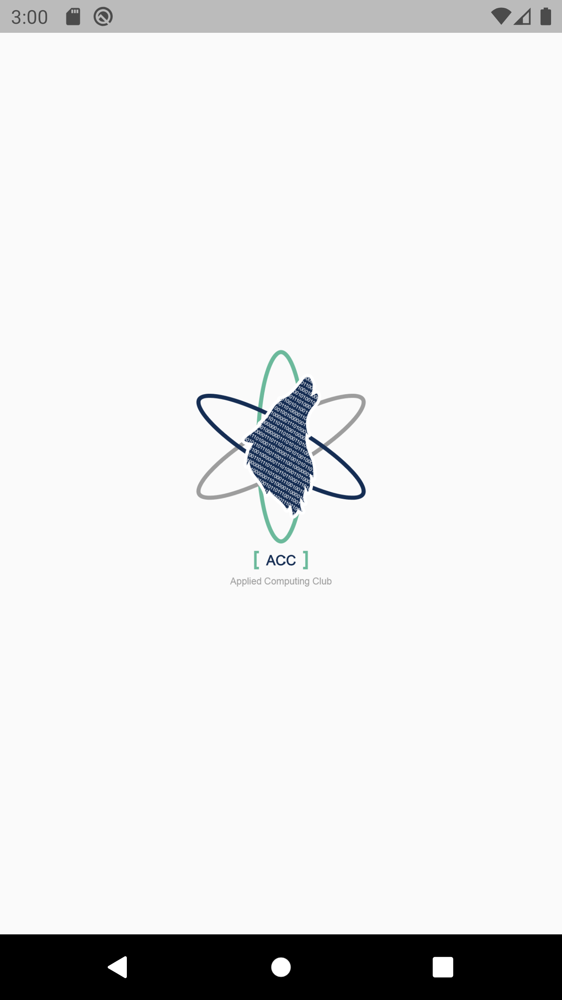
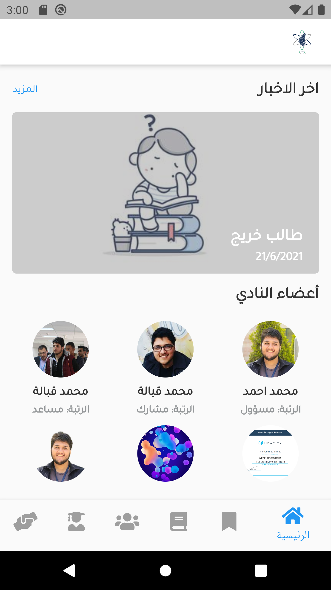
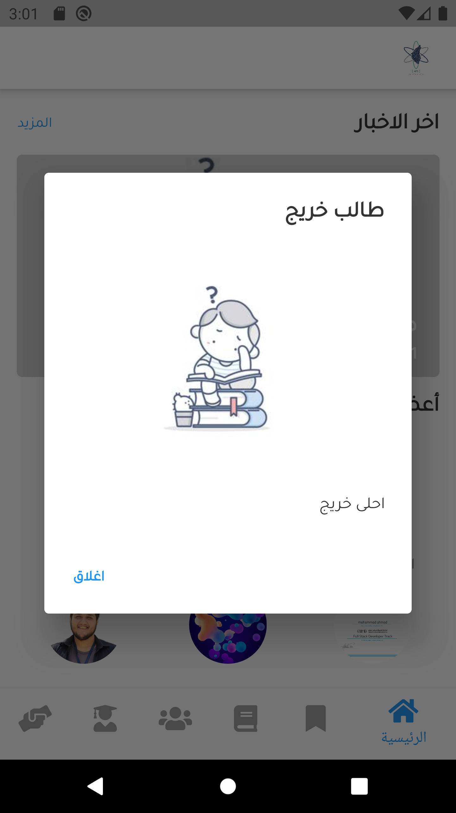
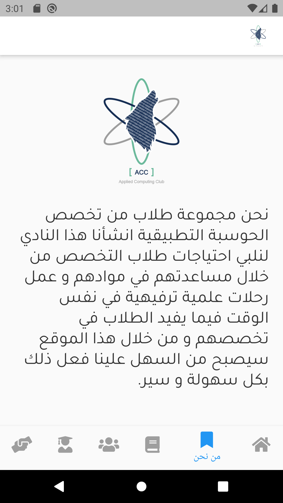
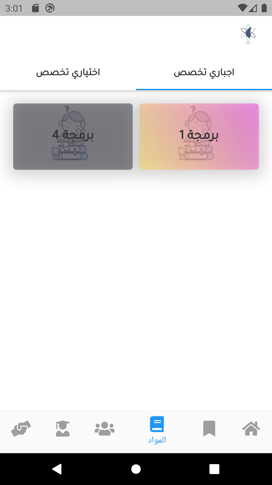
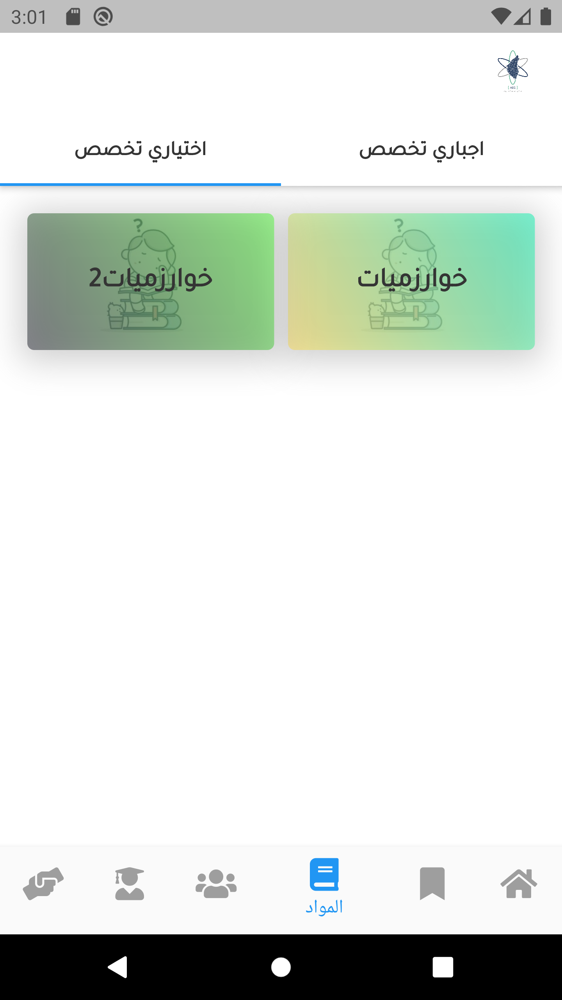
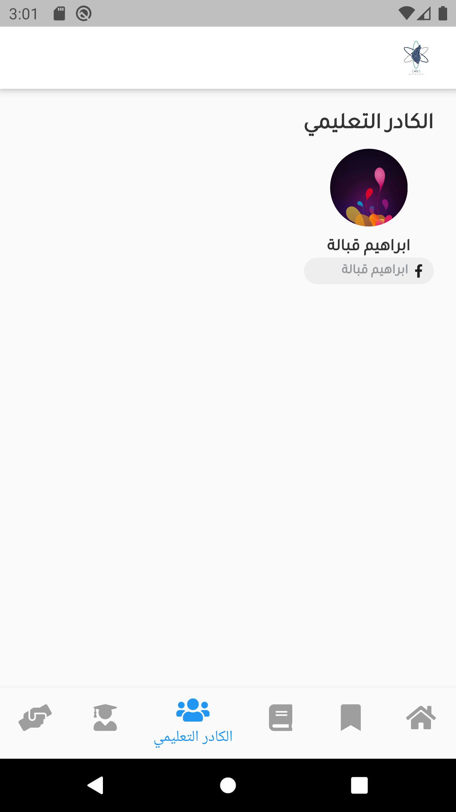
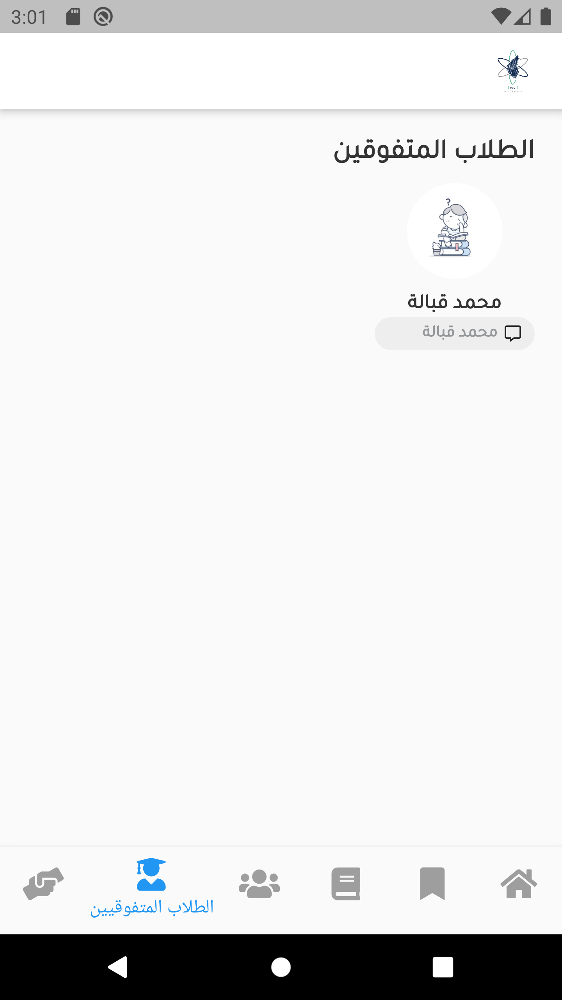
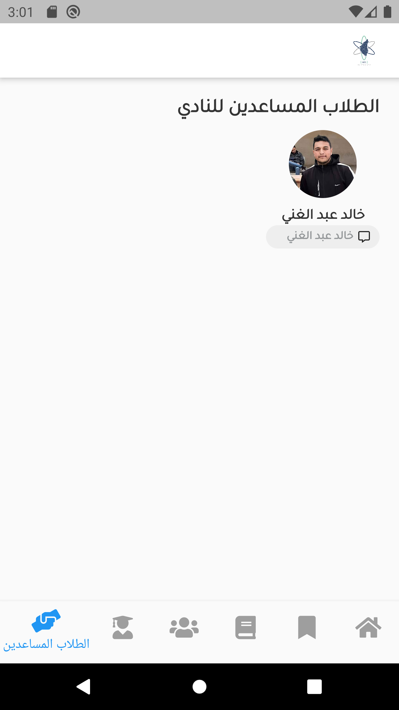

# ACC APP

An app for Applied Computing Club(ACC) at Palestine Technical Univ(PTUK), helps students majoring in Applied Computing In terms of materials, getting to know the specialization, facilitating the learning process and understanding the specialization subjects decided for them.

## App Pages

Loading Screen

Home Screen

News Dialog

About Screen

Required Courses Tab Screen

Optional Courses Tab Screen

Educational Staff Screen

Outstanding Students Screen

Helper Students Screen

